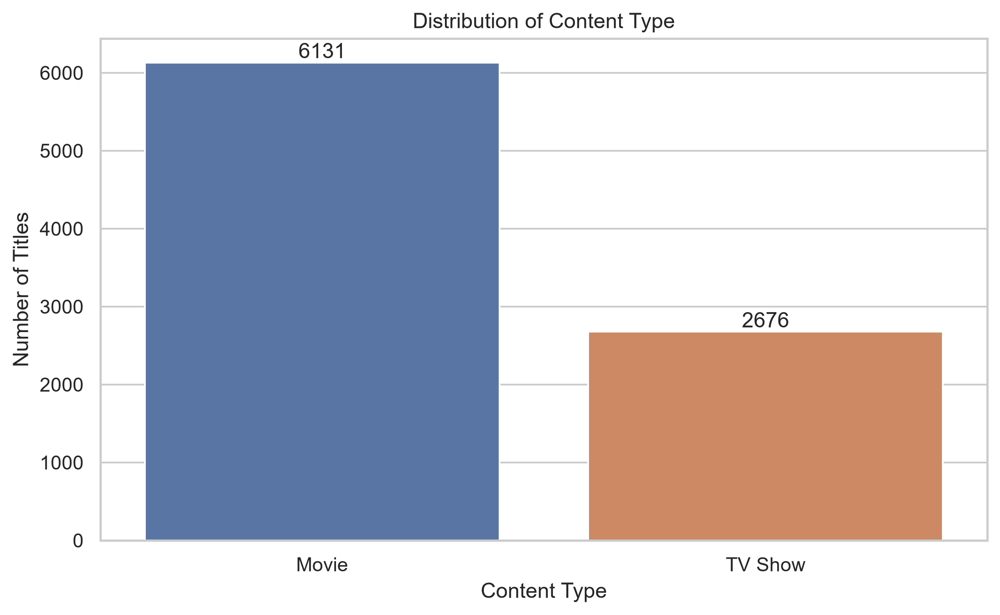
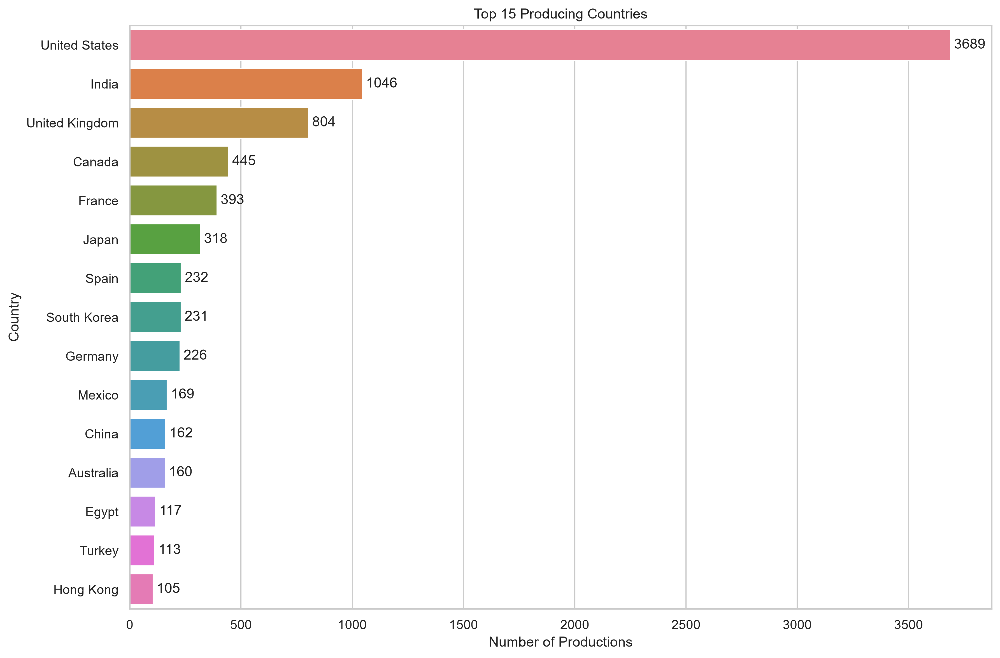
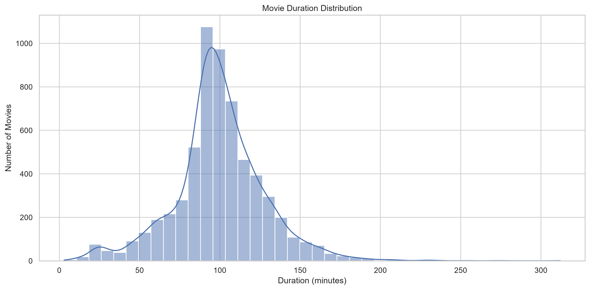
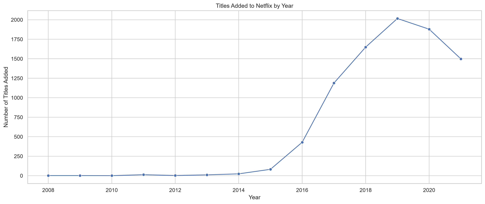

# Netflix Exploratory Data Analysis (EDA)

## Project Overview

This project performs an Exploratory Data Analysis (EDA) on the Netflix Movies and TV Shows dataset.

The objective is to answer business questions using Python and data visualization techniques, simulating the workflow of a Data Analyst.

---

## Objectives

The analysis aims to answer questions such as:

- Is Netflix's catalog composed mostly of movies or TV shows?
- Which countries produce the most content?
- Which genres are the most common?
- How has the catalog evolved over time?
- What is the average duration of Netflix movies?
- Are there outliers in movie duration?
- Which actors appear most frequently?

---

## Dataset

Netflix Movies and TV Shows

Main file:

```text
data/raw/netflix_titles.csv
```

---

## Technologies

- Python
- Pandas
- NumPy
- Matplotlib
- Seaborn
- Missingno
- Jupyter Notebook
- Git
- GitHub

---

## Project Structure

```text
data/
images/
notebooks/
README.md
requirements.txt
```

---

## Methodology

This project follows the CRISP-DM methodology.

### 1. Business Understanding

Definition of business questions.

### 2. Data Understanding

Exploration of the dataset structure.

### 3. Data Preparation

Cleaning, transformation and feature engineering.

### 4. Exploratory Data Analysis

Business-oriented visualizations.

### 5. Insights

Interpretation of results.

---

## Main Analysis

- Data Cleaning
- Missing Values
- Duplicate Detection
- Country Analysis
- Genre Analysis
- Director Analysis
- Actor Analysis
- Duration Analysis
- Outlier Detection
- Time Series Analysis

---

## Key Findings

- Movies represent the majority of the catalog.
- The United States is the leading producing country.
- Drama is the most common genre.
- Netflix significantly expanded its catalog after 2015.
- Most movies have durations between 80 and 120 minutes.
- A small number of movies present unusually long durations.

---

## Repository

Clone the project:

```bash
git clone https://github.com/SEU-USUARIO/netflix-eda.git
```

Install dependencies:

```bash
pip install -r requirements.txt
```

Launch Jupyter:

```bash
jupyter notebook
```

---

## Future Improvements

- Interactive dashboard with Plotly
- Power BI dashboard
- Recommendation system
- Machine Learning models
- Sentiment analysis using movie descriptions

---
## Sample Visualizations

### Content Distribution



---

### Top Producing Countries



---

### Movie Duration Distribution



---

### Content Added Over Time



---

## Author

Rodrigo C. Furlan

